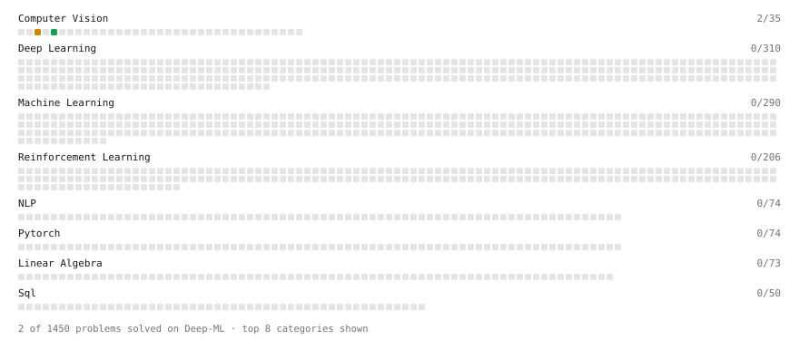

# Deep-ML

My machine learning practice from [Deep-ML](https://www.deep-ml.com). Every solution here was written by hand.

**5** solved · 5 problems · 0 labs · 0 math

[**Browse the interactive portfolio**](https://Bayon-idris.github.io/deep-ml/) to replay this filling in over time.

## Problems

| | Difficulty | Solved | |
| --- | --- | --- | --- |
| [Calculate Image Brightness](https://www.deep-ml.com/problems/70) | easy | 2026-09-23 | [solution](problems/0070-calculate-image-brightness) |
| [Convert RGB Image to Grayscale](https://www.deep-ml.com/problems/237) | easy | 2026-09-24 | [solution](problems/0237-convert-rgb-image-to-grayscale) |
| [Flip an Image Horizontally or Vertically](https://www.deep-ml.com/problems/238) | easy | 2026-09-24 | [solution](problems/0238-flip-an-image-horizontally-or-vertically) |
| [Grayscale Image Contrast Calculator](https://www.deep-ml.com/problems/82) | easy | 2026-09-23 | [solution](problems/0082-grayscale-image-contrast-calculator) |
| [Optical Flow EPE with Masks (OmniWorld-style metric)](https://www.deep-ml.com/problems/185) | medium | 2026-09-24 | [solution](problems/0185-optical-flow-epe-with-masks-omniworld-style-metric) |

---

_This file is regenerated by Deep-ML on every push._
