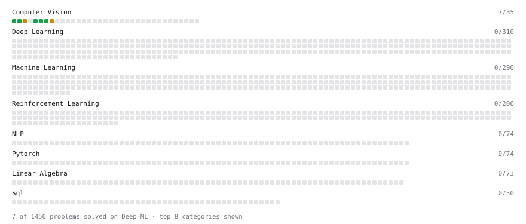

# Deep-ML

My machine learning practice from [Deep-ML](https://www.deep-ml.com). Every solution here was written by hand.

**12** solved · 12 problems · 0 labs · 0 math

[**Browse the interactive portfolio**](https://Bayon-idris.github.io/deep-ml/) to replay this filling in over time.

## Problems

| | Difficulty | Solved | |
| --- | --- | --- | --- |
| [Apply Zero Padding to an Image](https://www.deep-ml.com/problems/239) | easy | 2026-09-24 | [solution](problems/0239-apply-zero-padding-to-an-image) |
| [Autoregressive Video Chunk FPS Calculator](https://www.deep-ml.com/problems/454) | easy | 2026-09-29 | [solution](problems/0454-autoregressive-video-chunk-fps-calculator) |
| [Batch a TensorDataset with DataLoader](https://www.deep-ml.com/problems/1237) | easy | 2026-10-06 | [solution](problems/1237-batch-a-tensordataset-with-dataloader) |
| [Calculate Image Brightness](https://www.deep-ml.com/problems/70) | easy | 2026-09-23 | [solution](problems/0070-calculate-image-brightness) |
| [Convert RGB Image to Grayscale](https://www.deep-ml.com/problems/237) | easy | 2026-09-24 | [solution](problems/0237-convert-rgb-image-to-grayscale) |
| [Flip an Image Horizontally or Vertically](https://www.deep-ml.com/problems/238) | easy | 2026-09-24 | [solution](problems/0238-flip-an-image-horizontally-or-vertically) |
| [Grayscale Image Contrast Calculator](https://www.deep-ml.com/problems/82) | easy | 2026-09-23 | [solution](problems/0082-grayscale-image-contrast-calculator) |
| [Anchor Matching via IoU Assignment](https://www.deep-ml.com/problems/1253) | medium | 2026-10-06 | [solution](problems/1253-anchor-matching-via-iou-assignment) |
| [Bilinear Image Resizing](https://www.deep-ml.com/problems/240) | medium | 2026-09-27 | [solution](problems/0240-bilinear-image-resizing) |
| [Optical Flow EPE with Masks (OmniWorld-style metric)](https://www.deep-ml.com/problems/185) | medium | 2026-09-24 | [solution](problems/0185-optical-flow-epe-with-masks-omniworld-style-metric) |
| [Sobel Edge Detection](https://www.deep-ml.com/problems/241) | medium | 2026-09-27 | [solution](problems/0241-sobel-edge-detection) |
| [PCA Color Augmentation](https://www.deep-ml.com/problems/191) | hard | 2026-10-01 | [solution](problems/0191-pca-color-augmentation) |

---

_This file is regenerated by Deep-ML on every push._
